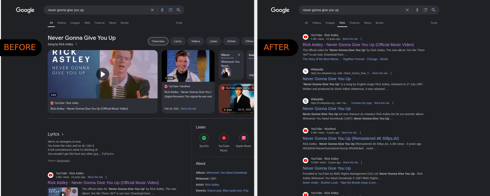

<a href="https://addons.mozilla.org/en-GB/firefox/addon/straight-to-the-web/"></a>

# Straight to the web


## About

Web mode is a feature of Google search that disables AI suggestions and widgets (such as calculator, etc), recommendations, and more.

This plugin forces all Google searches to use the new 'Web' mode.This effectively disables all the unnecessary features to only give you search results without the fluff.

You can disable this feature at any time by clicking on the plugin icon in the toolbar.

This won't improve search results, but should give you a better access to the information you are actually looking for, without being drowned in recommendations, AI generated content, etc.

Thanks to Google's Gemini for suggesting the name!



## Obtaining the addon
<a href="https://addons.mozilla.org/en-GB/firefox/addon/straight-to-the-web/">Get it on Mozilla Addons</a>

<a href="https://github.com/ShadowMitia/Straight-to-the-web/releases/latest" alt="Grab it from the latest release">Grab it from the latest release</a>

## Development

Clone the repo over at https://github.com/ShadowMitia/Straight-to-the-web.git, then
go in the root directory and run:

```
make
```

It will build the straight-to-web.xpi package that you can then test inside your browser.


# Technical details

The plugin appends search parameters to Google Search URLs when appropriate to enable Web mode automatically.

## More information about 'Web mode'

[🇬🇧 EN] https://arstechnica.com/gadgets/2024/05/google-searchs-udm14-trick-lets-you-kill-ai-search-for-good/

[🇫🇷 FR] https://intelligence-artificielle.developpez.com/actu/358316/Desactiver-l-IA-dans-Google-Search-avec-le-parametre-udm-egal-14-vous-pouvez-mettre-un-terme-aux-resumes-de-l-IA-et-retrouver-une-experience-de-recherche-traditionnelle/

# License

Unless otherwise specified the repository is shared under the MIT license.

Browser icon based on the one from ["bitsies!" by Recep Kütük](https://www.iconfinder.com/iconsets/bitsies), used with permission. See link for more details.
